```{r setup, include=FALSE}
knitr::opts_chunk$set(echo = FALSE, cache=TRUE, messages=FALSE, warning=FALSE)
# Make sure you have the latest version of rmarkdown and bookdown
#devtools::install_github("rstudio/rmarkdown")
#devtools::install_github("rstudio/bookdown")
library(readxl)
library(tidyverse)
library(ggplot2)
library(viridis)
library(maps)
library(sf)
library(knitr)
```


# Introduction

|       Medicinal plants have been recognized and used in traditional medical practices since prehistorical times. Medicinal plants are also called as medicinal herbs [@article39]. Herbal treatments have the ability to heal and boost physical and mental well-being [@article39]. More than one-tenth of plant species are used in drugs and health products, with more than 50,000 species are being used [@article40]. According to [@article39], the World Health Organization (WHO) confirmed that 11\% of the drugs are considered as "basic and essential" at the beginning of the 21st century. These drugs are made using the flowering plant origin. Morphine, codeine, and quinine are some of the drugs which contain plant-derived ingredients [@article39]. 

|       There are between 50,00 and 80,000 flowering plant species are used for medicinal purposes worldwide according to the International Union for Conservation of Nature (IUCN) [@article40]. There are over 1300 medicinal plants used in Europe [@article40]. Among them 90\% are harvested from wild resources [@article40]. About 118 of the top 150 prescription drugs are based on natural sources in the United States [@article40]. In developing countries, up to 80\% of people are totally dependent on herbal drugs for their primary healthcare [@article40]. In developed countries, over 25\% of prescribed medicines are derived from wild plant species [@article40].
	
	 

```{r,comment=NA, message=FALSE, warning=FALSE, include=FALSE}
data <- read_excel("Data_intro/Med_plants.xlsx")
data %>% head(5)
data$Country <- as.factor(data$Country)
df <- data %>% mutate(Percentage = round(Medicinal_plant_species * 100/Plant_species,2))
df %>% head(5)
```


```{r unf1,comment=NA, message=FALSE, warning=FALSE, fig.cap="Distribution of medicinal plants in the world (Source: @inbook)", fig.pos='!ht'}
df <- df[order(df$Medicinal_plant_species, decreasing = T),]

ggplot(df, aes(x= reorder(Country, Medicinal_plant_species), y=Medicinal_plant_species)) + geom_bar(stat = "identity") + coord_flip() + labs(y="Number of medicinal plants", x="Country") 
```


|       The distribution of medicinal plants is not uniform across the world [@article40]. China and India have the highest number of medicinal plants [@article40]. According to @article40 China has 11,146 species and India has 7,500 species of medicinal plants. Colombia, South Africa, the United States and another 16 countries with percentages of medicinal plants ranging from 7\% in Malaysia to 44\% in India versus their total numbers of plant species [@article40]. As shown in diversity chart (Figure \ref{fig:unf1}), Sri Lanka is in the top 15 with 550 medicinal plants [@article38].


```{r unf2,comment=NA, message=FALSE, warning=FALSE, fig.cap="Number of medicinal plants in the world compared with their total plant distribution (Source: @inbook)", fig.pos='!ht'}
df <- df[order(df$Percentage, decreasing = T),]

ggplot(df, aes(x= reorder(Country, Percentage), y=Percentage)) + geom_bar(stat = "identity") + coord_flip() + labs(y="Percentage(%)", x="Country") 
```


|       But when considering the number of medicinal plants compared with their total plant distribution (Figure \ref{fig:unf2}), Sri Lanka is in the top 7. Even though Sri Lanka is the "Pearl of Indian ocean", it is rich of medicinal plants.


```{r,comment=NA, message=FALSE, warning=FALSE, include=FALSE}
data1 <- read_excel("Data_intro/Trade.xlsx")
data1 %>% head(5)
data1$Country <- as.factor(data1$Country)
data1 <- data1 %>% head(20)
```

```{r unf3,comment=NA, message=FALSE, warning=FALSE, fig.cap="Distribution of exportation of medicinal plants in Sri Lanka (Source: 2020, Trade Map - Trade statistics for international business development, https://www.trademap.org/Index.aspx)", fig.pos='!ht'}
data1 <- data1[order(data1$Value_exported, decreasing = T),]

ggplot(data1, aes(x= reorder(Country, Value_exported), y=Value_exported)) + geom_bar(stat = "identity") + coord_flip() + labs(y="Exported value (USD thousand)", x="Country") 
```


|       Therefore Sri Lanka has a good market in exporting medicinal plants around the world. The bulk of medicinal plants are exported by Sri Lanka not only to the developing countries, but also to the developed countries which have a high number of medicinal plant species. As shown in Figure \ref{fig:unf3}, China, India, Hong Kong China, Germany, United States of America, United Kingdom, Netherlands, Australia, Singapore, and Canada are the developed countries that are in the top 20 of exportation of medicinal plants in Sri Lanka.


```{r,comment=NA, message=FALSE, warning=FALSE, include=FALSE}
data3 <- read_excel("Data_intro/Trade_Data_10yrs.xlsx")
data3 %>% head(1)
data3 <- data3 %>% head(1)

data3 <- data3 %>% pivot_longer(!Exporters, names_to = "txt", values_to = "Total_Export_Value")

data4 <- data3 %>% separate(txt, into = c("t1", "t2", "t3", "Year"), sep = "\\s", extra = "merge")

data4$Year <- as.integer(data4$Year)

data4 <- data4 %>% select(5,6)

data4 %>% head(10)
```

```{r unf4,comment=NA, message=FALSE, warning=FALSE, fig.cap="Distribution of exportation of medicinal plants in Sri Lanka (Source: 2020, Trade Map - Trade statistics for international business development, https://www.trademap.org/Index.aspx)", fig.pos='!ht'}

data4 %>% ggplot(aes(x = Year, y = Total_Export_Value)) + geom_point() + geom_line() + ylab("Total export value (USD thousand)")
```


|       As shown in Figure \ref{fig:unf4}, the highest total exportation value recorded in 2014. After 2015 total exportation value is around 3200000 (USD thousand). 


|       Located in the tropics, Sri Lanka has a collection of plant species with various medicinal properties that have been consumed for generations as herbal treatments, for control of diseases and various medical issues. Traditional medicine system which has more than 3000 years of tested and proven efficacy, is still in use [@PMID]. It consists of Ayurveda, Unani, and Deshiya Chikitsa [@article20]. Some of the diseases with complicated etiologies such as diabetes, arthritis, and cancer (for which a permanent cure is not in sight at present) [@PMID] have been known to be completely controlled or cured using the traditional medicinal treatments alone [@articleintro1]. Various plant parts such as leaves, roots, fruits, flowers, and bark are used to treat disease conditions [@article20] in the traditional medicinal system [@8675114].
	
	
|       There is no standard mechanism in identification of medicinal plants. Therefore we are introducing a automatic statistical based approach to identify medicinal plants. 

|       There are many research established all over the world not only by the botanists, taxonomists [@articlee] but also by data scientists and computer scientists to identify medicinal plants. Most of the researches are based on the images or photographs of the parts [@articlee] of the medicinal plants. Some time the user captured the photographs by using a built-in camera of a mobile device [@articlee] or a special camera or a scanner. Authors in @8675114 identified that the less availability of adequate databases. Most of the dataset contain images of few plant species [@8675114; @articlee]. The authors in @8675114 mentioned the restrictions while capturing the plant images. Single leaf, light illumination, shadow effect, and line of sight angle are to name a few. Most of the research were focused on shape features [@8675114]. It was not sufficient train reliable model properly. To train the data most of the time researchers focused on Neural network model that are complicated and hard to understand what happening inside the algorithm [@4458016; @articlepl; @inproceedings]. There were no proper features, no standard database, and no automatic way to identify medicinal plants species in Sri Lanka by using leaf images.

|       By addressing the issues above our main objective is to develop an automatic algorithm to classify medicinal plants by using statistical machine learning approach. To achieve our main objective we have to follow the sub objectives. Develop a database with large repository of leaf images of medicinal plants in Sri Lanka, best and simplest approach to follow in leaf image acquisition and leaf image processing are the sub objectives of our research. To develop an algorithm we need a large repository of leaf images. A database of leaf images of medicinal plants in Sri Lanka is not yet available. Hence through this research, we established a repository of leaf images of medicinal plants in Sri Lanka. Researchers use special cameras and iPhones to take photos. Not only that they use special technique to control light illumination, shadow effect, and line of sight angle. For this research, we used a normal smartphone (Huawei nova 3i). Through this research, we introduced the best image acquisition steps that has to follow in collecting actual leaf images of medicinal plants in Sri Lanka without special techniques to handle effects. We also defined what is the most appropriate image processing approach has to follow when dealing with actual leaf images of medicinal plants in Sri Lanka.

|       Normally medicinal plants are grown in the backyards of houses and very little nurturing effort [@PMID] is required for their growth. They also have high growth rates. Therefore sometimes medicinal plants are considered as weeds [@PMID]. Most Sri Lankans are familiar with the traditional medicinal system and are even able to identify or administer [@PMID] the medicinal plants growing within their area of residence. Therefore, the locals can be observed consuming these medicinal plants to control a disease without the advice of a traditional medicinal practitioner, as they are familiar with the usage of these herbs because of the traditional knowledge, which has been passed down by their ancestors [@PMID]. Substantial botanical expertise is required by the manual identification process and it is also time-consuming. This identification process is a very challenging task for the general public.

|       The significance of this research is to avoid misidentifying medicinal plants in Sri Lanka. This is beneficial in conservation and ecological efforts. Author of [@article12] defines endangered medicinal plants as the plants which are facing a high risk of becoming extinct because they are either few in numbers, or threatened by changing environmental parameters. The International Union for Conservation of Nature (IUCN) has defined Threatened Herbal plants in three schemes as Critically Endangered, Endangered, and vulnerable. In the world, nearly 15,000 species of medicinal plants are now threatened. In Sri Lanka 280 plant species are threatened. According to the recent surveys [@article12], there are 1432 medicinal plant species in Sri Lanka, and out of the 100-200 species are threatened. Abarema begimena, Ashoka tree(Saraca Asoka), Beautiful Leaf(Calopyllum trapezifolium), Aglaia apiocarpa are few of them.

# Methodology \& Flow of the Study

## Introduction


```{r ovAlgo, fig.cap="Overview of Methodology", fig.pos='h!', fig.height = 5, fig.width = 8, out.width="90%", fig.align="center"}
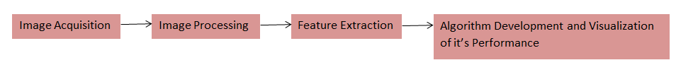
```


|       Work flow of the study contains main 4 steps as:


1. Image Acquisition

2. Image Processing

3. Feature Extraction

4. Algorithm Development and Visualization of Algorithm Performance


```{r test, fig.cap="Methodology Diagram", fig.pos='h!', fig.height = 5, fig.width = 8, out.width="90%", fig.align="center"}
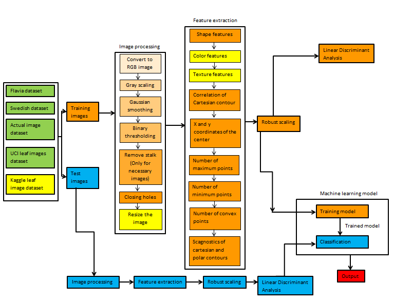
```


\indent Figure \ref{fig:test} shows the overview of the methodology that we followed. Online phase of the study is colored by orange and offline phase of the study is colored by blue. Firstly we acquire the images of leaves from existing datasets and the leaf image dataset that was collected by ourselves. Then each leaf image data set is divided as training and test images. Training image dataset was contained 80\% of the images and test image dataset is contained 20\% of the images from each leaf image dataset. Next step is image processing. As shown in Figure \ref{fig:test}, the main image processing steps are Convert to RGB image, Gray scaling, Gaussian smoothing, Binary thresholding, Remove stalk, Closing holes and Resize image. Since Kaggle leaf image dataset contains only binary images, resizing step is enough as an image processing technique. We can follow remove stalk and closing holes technique only if the dataset contains leaf images with stalk and with holes (eg:- diseased leaves). After applying image processing steps, the images are ready to extract features. There are mainly Shape, Color, Texture, and Scagnostics features of Cartesian and polar coordinates. In our research we also introduce some new features: Correlation of Cartesian contour, x and y coordinates of the contour, Number of minimum and maximum points, Number of convex points. Now the dataset contained all the features with the leaf image id. But Kaggle leaf image dataset doesn't have Color and Texture features. Robust scaling is applied to scale the data. To visualize the feature dataset with labels, Linear Discriminant Analysis is used. All the labels are added by ourselves. The knowledge that gain by studying Ruhuna medicinal plants dataset was useful to include these labels. Next step is to train the model for the training dataset by using machine learning techniques. This is a multi class classification problem. The trained model is used to predict labels in the the test dataset.  

# Image Acquisition \& Image Processing

## Image Acquisition

### Introduction

|       The purpose of this step is to obtain the image of the leaf so that analysis towards classification can be performed. Five leaf datasets of different countries are used for the research. Because to generalize the features and algorithm, we have to have leaf images collected by different countries in different methods like scans, pseudo-scans and photography. There is one primary dataset and three secondary datasets.

```{r map,comment=NA, message=FALSE, warning=FALSE, fig.cap="Locations of the acquired datasets", fig.pos='!ht'}
world_map <- map_data("world")

countries <- c("China", "Sri Lanka", "Sweden", "UK")
some.maps <- map_data("world", region = countries)

region.lab.data <- some.maps %>% group_by(region) %>% summarise(long = mean(long), lat = mean(lat))

ggplot() + geom_map(data = world_map, map = world_map, aes(long, lat, map_id = region), color = "white", fill = "lightgray", size = 0.1) + geom_point(data = region.lab.data, aes(x=long, y=lat), color = "red") + geom_text(aes(long, lat,label = region), data = region.lab.data, size =3, hjust = 0.5, vjust = 1.2) 
```


### Image Description Analysis

1. Primary Data

* Image Collection Process

```{r test1, fig.cap="Image collection process of medicinal plants in Sri Lanka", fig.pos='h!', fig.height = 5, fig.width = 8, out.width="90%", fig.align="center"}
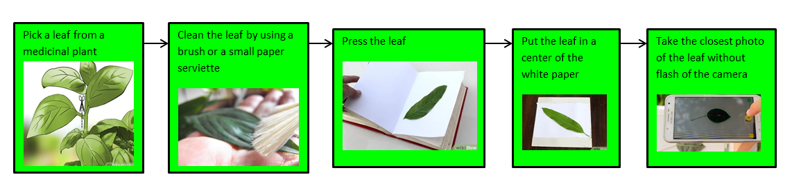
```

    
|       Firstly we have to select a plant that we are going to use for this classification. Then have to find a leaf and pick it. In this step, have to be more careful about selecting the leaf. Our algorithm considers only the leaf images without any diseases. When picking the leaf, use a scissor to pick the leaf without petiole. Because the algorithm considers only the leaf without petiole. Make sure that the leaf has to pick in the morning time. Because the leaf looks fresh in the morning time.

|       After picking the leaf, have to clean it by using a small brush or a piece of paper serviette. Because there are small water bubbles, soil seeds and mud patches.

|       In some cases, the leaf looks like rounding from the apex or base or margin of the leaf can’t put on a flat surface. Therefore will be problematic when putting it to the algorithm. Because the algorithm is difficult to capture the shape of the leaf correctly. To avoid these problems, press the leaf approximately 1 or 2 days (In some cases less than 1 day is enough), before taking the photos.

|       Then keep the pressed leaf in a white paper. In this step, we have to consider about where we have to keep it. Make sure to keep the leaf in the centre of the white paper. The reason is that the converting to binary image work well when the leaf is in the centre of the white paper.

|       Finally when taking the photo, have to take the closest photo without the flash of the camera (see figure \ref{fig:correct}). Closest photo because algorithm is difficult to extract the contour of a very small leaf (see figure \ref{fig:ex1}), decrease the amount of computational load that is exerted upon the graphic processing unit, and reduce the unnecessary foreground region [@8675114]. When converting to the binary images, to capture the shape of the leaf correctly have to remove the shadow of the leaf much as can. Therefore by using the camera without flash, can remove the shadow (see figure \ref{fig:flash}). Make sure the photo is taken in the daylight to ignore the effect of light illumination.      


```{r flash, fig.cap="With flash", fig.pos='h!', fig.height = 5, fig.width = 8, out.width="90%", fig.align="center"}
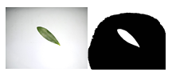
```


```{r ex1, fig.cap="Not closest photo without flash", fig.pos='h!', fig.height = 5, out.width="90%", fig.align="center", fig.width = 8}
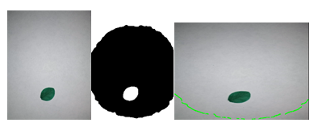
```


```{r correct, fig.cap="Closest photo without flash", fig.pos='h!', fig.height = 5, out.width="90%", fig.align="center", fig.width = 8}
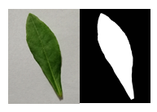
```


|       By considering the steps of leaf image acquisition of existing datasets like Flavia and Swedish, we introduced a simple approach in collecting leaf images. This approach can be easily followed by anyone without much knowledge of botanical science. 

* Labeling Images \& Composition

\begin{center}
\begin{longtable}{|p{3cm}|p{4cm}|p{3cm}|p{4.5cm}|}
\caption{Actual images with their local, scientific name}
\label{tab:act}\\

\hline \multicolumn{1}{|c|}{\textbf{Local name}} & \multicolumn{1}{c|}{\textbf{Scientific name}} & \multicolumn{1}{c|}{\textbf{Number of images}} & \multicolumn{1}{c|}{\textbf{Image}} \\ \hline 
\endfirsthead

\multicolumn{4}{c}%
{{\bfseries \tablename\ \thetable{} -- continued from previous page}} \\
\hline \multicolumn{1}{|c|}{\textbf{Local name}} & \multicolumn{1}{c|}{\textbf{Scientific name}} & \multicolumn{1}{c|}{\textbf{Number of images}} & \multicolumn{1}{c|}{\textbf{Image}} \\ \hline 
\endhead

\hline \multicolumn{4}{|r|}{{Continued on next page}} \\ \hline
\endfoot

\hline \hline
\endlastfoot
Adathoda         & \textit{Justicia adhathoda}        & 37               &  \includegraphics[scale=0.02]{./Figures/Adathoda.jpg}     \\ \hline
Akkapana         & \textit{Kalanchoe laciniata}       & 36               &  \includegraphics[scale=0.02]{./Figures/Akkapana.jpg}    \\ \hline
Belathana        & \textit{Eleusine indica}           & 35               &  \includegraphics[scale=0.02]{./Figures/Belathana.jpg}     \\ \hline
Beli             & \textit{Aegle marmelos}            & 43               &  \includegraphics[scale=0.02]{./Figures/Beli.jpg}    \\ \hline
Bilin            & \textit{Averrhoa bilimbi}          & 32               &  \includegraphics[scale=0.02]{./Figures/Bilin.jpg}    \\ \hline
Bulath           & \textit{Piper betle}               & 44               &  \includegraphics[scale=0.02]{./Figures/Bulath.jpg}     \\ \hline
Dehi             & \textit{Citrus aurantifolia}       & 40               &  \includegraphics[scale=0.02]{./Figures/Dehi.jpg}     \\ \hline
Delum            & \textit{Puncia granatum}           & 32               &  \includegraphics[scale=0.02]{./Figures/Delum.jpg}     \\ \hline
Gammiris         & \textit{Piper nigrum}              & 45               &   \includegraphics[scale=0.02]{./Figures/Gammiris.jpg}    \\ \hline
Gotukola         & \textit{Centella asiatica}         & 31               &  \includegraphics[scale=0.02]{./Figures/Godukola.jpg}     \\ \hline
Heen hathavariya & \textit{Asparagus racemosus}       & 29               &  \includegraphics[scale=0.02]{./Figures/Hathawariya.jpg}     \\ \hline
Inguru           & \textit{Kaempferia galanga}        & 45               &  \includegraphics[scale=0.02]{./Figures/Iguru.jpg}     \\ \hline
Iramusu          & \textit{Hemidesmus indicus}        & 45               &  \includegraphics[scale=0.02]{./Figures/Iramusu.jpg}     \\ \hline
Iriweriya        & \textit{Plectranthus zeylanicus}   & 30               &  \includegraphics[scale=0.02]{./Figures/Iriweriya.jpg}     \\ \hline
Karmaranga       & \textit{Averrhoa carambola}        & 44               &  \includegraphics[scale=0.02]{./Figures/Kabaranka.jpg}     \\ \hline
Karapincha       & \textit{Murraya koenigii}          & 32               &  \includegraphics[scale=0.02]{./Figures/Karapincha.jpg}     \\ \hline
Kohomba          & \textit{Azadirachta indica}        & 30               &  \includegraphics[scale=0.02]{./Figures/Kohoba.jpg}     \\ \hline
Kuppameniya      & \textit{Acalypha indica}           & 31               &  \includegraphics[scale=0.02]{./Figures/Kuppameniya.jpg}     \\ \hline
Kurudu           & \textit{Cinnamomum zeylonica}      & 34               &   \includegraphics[scale=0.02]{./Figures/Kurudu.jpg}    \\ \hline
Mukunuwenna      & \textit{Alternanthera sessilis}    & 32               &  \includegraphics[scale=0.02]{./Figures/Mukunuwanna.jpg}     \\ \hline
Murunga          & \textit{Moringa oleifera}          & 30               &  \includegraphics[scale=0.02]{./Figures/Murunga.jpg}     \\ \hline
Nil katarolu     & \textit{Clitoria ternatea}         & 37               &  \includegraphics[scale=0.02]{./Figures/Nil_katarolu.jpg}     \\ \hline
Passion fruit    & \textit{Passiflora edulis}         & 30               &  \includegraphics[scale=0.02]{./Figures/Passion.jpg}     \\ \hline
Wel penela       & \textit{Cardiospermum halicacabum} & 32               &  \includegraphics[scale=0.02]{./Figures/Penela.jpg}     \\ \hline
Polpala          & \textit{Aerva lanata}              & 30               &  \includegraphics[scale=0.02]{./Figures/Polpala.jpg}     \\ \hline
Rasakinda        & \textit{Tinospora cordifolia}      & 49               &  \includegraphics[scale=0.02]{./Figures/Rasakida.jpg}     \\ \hline
Rathmal          & \textit{lxora coccinea}            & 30               &  \includegraphics[scale=0.02]{./Figures/Rathmal.jpg}     \\ \hline
Thebu            & \textit{Costus speciosus}          & 32               &  \includegraphics[scale=0.02]{./Figures/Thebu.jpg}     \\ \hline
Thel erandu      & \textit{Ricinus communis}          & 37               &  \includegraphics[scale=0.02]{./Figures/Thel_eradu.jpg}     \\ \hline
Pethi thora      & \textit{Cassia tora}               & 31               &  \includegraphics[scale=0.02]{./Figures/Thora.jpg}     \\ \hline
Wel dodam        & \textit{Passiflora edulis}         & 34               &  \includegraphics[scale=0.02]{./Figures/Weldodam.jpg}     \\ \hline
\end{longtable}
\end{center}

|       This dataset consists of 1,099 images of leaf images of 31 species and 29-45 images per species of medicinal plants in Sri Lanka. These have simple arrangement. The photographs were taken from the device, Huawei nova 3i. The closest photographs were captured on a white background.

2. Secondary Data

* Flavia Leaf Image Dataset
    
|       The Flavia dataset contains 1907 leaf images. There are 32 different species and each have 50-77 images. Scanners and digital cameras are used to acquire the leaf images on plain background. The isolated leaf images contain blades only, without petiole. These leaf images are collected from the most common plants in Yangtze, Delta, China [@articlee]. Those leaves were sampled on the campus of the Nanjing University and the Sun Yat-Sen arboretum, Nanking, China [@articlee]. (\url{https://sourceforge.net/projects/flavia/files/Leaf%2520Image%2520Dataset/})


```{r slp1, fig.cap="Sample of Flavia dataset", fig.pos='h!', fig.height = 5, fig.width = 8, out.width="90%", fig.align="center"}
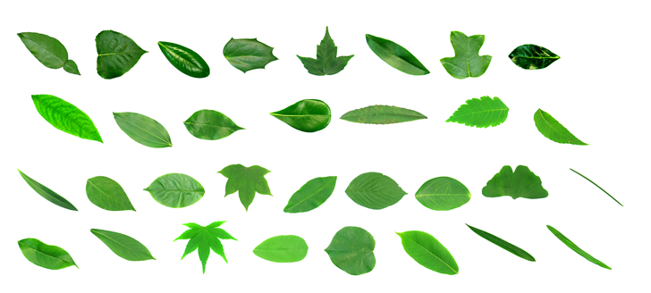
```


* Swedish Leaf Image Dataset
    
|       The Swedish dataset contains 1125 images. The images of isolated leaf scans on a plain background of 15 Swedish tree species, with 75 leaves per species. This dataset has been captured as part of a joined leaf classification project between the Linkoping University and the Swedish  Museum of Natural History [@articlee]. (\url{https://www.cvl.isy.liu.se/en/research/datasets/swedish-leaf/})


```{r slp2, fig.cap="Sample of Swedish leaf dataset", fig.pos='h!', fig.height = 5, fig.width = 8, out.width="90%", fig.align="center"}
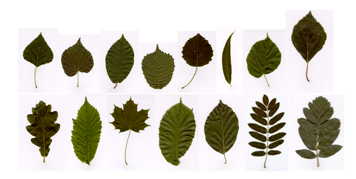
```


* Kaggle Leaf Image Dataset
    
|       This dataset consists of 1,584 images of leaf images of 99 species and 16 images per species. These leaf images were already converted to binary images. This dataset originates from leaf images collected by  James Cope, Thibaut Beghin, Paolo Remagnino, \& Sarah Barman of the Royal Botanic Gardens, Kew, UK. (\url{https://www.kaggle.com/c/leaf-classification})


```{r slp3, fig.cap="Sample of Kaggle leaf dataset", fig.pos='h!', fig.height = 5, fig.width = 8, out.width="90%", fig.align="center"}
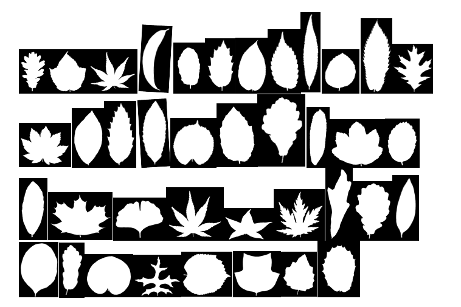
```

## Image Processing

### Introduction

|       The image processing receives an image as input and generates a modified image as an output which is suitable for better morphological analysis [@8675114], feature extraction. Image processing is an essential step to reduce noise, background subtraction and content enhancement in the identification process [@8675114].


### Image Processing Workflow


|       To improve the image of the leaf, a series of operations are followed. This research includes operations like converting BGR image to RGB, gray scaling, Gaussian filtering, binary thresholding, remove stalk, close holes, and image resizing. Some of these steps can be applied for the necessary cases like applying remove stalk to the leaf images which only have a stalk.


```{r fig:test2, fig.cap="Image processing", fig.pos='h!', fig.height = 5, fig.width = 8, out.width="90%", fig.align="center"}
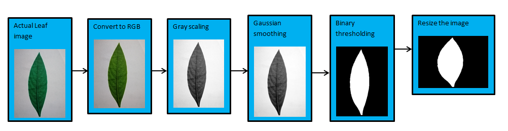
```


|       For the development of the system proposed the focus was on the leaf which has a simple arrangement.

\begin{table}
\centering
\begin{tabular}{|l|c|c|}

\hline
Dataset                   & \multicolumn{1}{l|}{Original Image Step} & \multicolumn{1}{l|}{Number of leaf images}  \\ \hline
Actual Leaf Image Dataset & Step 1 & 1099                                                                      \\ \hline
Flavia dataset            & Step 1 & 1907                                                                      \\ \hline

Swedish Leaf Image Dataset      & Step 1 & 975                                                                       \\ \hline
Kaggle Leaf Image Dataset & Step 5 & 1584                                                                      \\ \hline

\end{tabular}
\caption{Number of leaf images used in the algorithm}
\label{tab:num}
\end{table}


### Step 1: Converting BGR Image to RGB

|       BGR (Blue-Green-Red) and RGB(Red-Green-Blue) are conventions for the order of the different colour channels. They are not colour spaces. When converting BGR image to RGB, there is no any computations, just switches around the order. There is a difference in OpenCV and Matplotlib in pixel ordering. OpenCV follows BGR order while Matplotlib follows RGB order. Therefore when we want to display an image which loaded from OpenCV using Matplotlib functions, have to convert it to RGB mode.

### Step 2: Grayscaling

|       Grayscaling is the process of converting an image to shades of gray from other colour spaces like RGB. Gray conversion of the image is implemented to optimize the contrast and intensity of images [@8675114]. There are some importance of grayscaling:

* Dimension reduction
    
|       As an example, there are three colour channels in RGB images and has three dimensions. But in gray scaled images only have one dimension.
    
* For other algorithms to work
    
|       There are many algorithm customized to work only on gray scaled images. Eg:  Haralick texture features calculation works only on gray scaled images.
    
* Reduced model complexity
    
|       Consider an example of training neural article on RGB images of 10x10x3 pixel. The input layer will have 300 input nodes. Whereas for gray scaled images the same neural network will need only 100 input node.


### Step 3: Image Smoothing

|       Image smoothing is also known as image blurring in OpenCV. Image smoothing refers to making the image less clear or distinct. Image smoothing is done with the help of various low pass filter kernels. 

**Advantages of Smoothing**

|       Smoothing techniques help in noise removal. Noise of an image is considered as high pass signal which can be occurred because of the source (camera sensor). Therefore restrict noise by using the low pass kernel.

    * Helps in smoothing image.
    
    * To remove low intensity edges.
    
    * Helps in hiding the details when necessary. 
    E:g:- To hide the face of the victim in police cases.


|       There are many image smoothing techniques that are available in OpenCV. For our research we used Gaussian filtering as the image smoothing technique.

### Step 4: Gaussian Filtering (Gaussian Blurring/Gaussian Smoothing)

|       Gaussian function is used to blur the image. It is a linear filter which is done by using the functions in OpenCV. By specifying the width and height of the Gaussian kernel that must be positive and odd, and specifying the kernel standard deviation along x and y-axis, Gaussian smoothing is established in OpenCV. When the kernel standard deviation along x-axis is specified, kernel standard deviation along y-axis is taken as equal to the the kernel standard deviation along x-axis. But if both kernel standard deviation are given as zeros, they are calculated by using the kernel size. In our research the width and height of the kernel is defined as 55 and the kernel standard deviation along x-axis is assigned as zero.


### Step 5: Binary Thresholding

|       Thresholding is a segmentation technique that is used to separate foreground from its background. In thresholding technique, the pixel values are assigned by using the threshold value. By comparing each pixel value with the threshold value, the thresholding technique is worked.If the pixel value is smaller than the threshold value, the pixel value is set as 0, and if not the pixel value is set to a maximum value which is generally 255. Thersholding technique is done on grayscale images in Computer Vision. In our study, Kaggle leaf image dataset is already under the binary thresholding. 

|       We used Otsu's binarization which is an adaptive thresholding after Gaussian filtering to convert colour images to the binary images. In Otsu's method, the threshold value is determined automatically. The algorithm of Otsu's method finds the optimal threshold value which is chosen arbitrary.

**Otsu's Thresholding**

|       Nobuyuki Otsu is the investor of Otsu's method which is defined for a gray scale histogram $h_I$ of an input image $I$. To segment an image $I$ into two subsets of pixels Otsu's method calculates an optimal threshold $\tau$. Image $I$ is defined on a regular carrier $\Omega$ containing $|\Omega|$ pixel locations. 

|       The algorithm maximizes the variance $\sigma^2$ between the two subsets (Within-class-variance) to find the threshold $\tau$.

\[\sigma^2 = P_1(\mu_1-\mu)^2 + P_2(\mu_2-\mu)^2 = P_1P_2(\mu_1-\mu_2)^2 \]

where $\mu$ is the mean of the histogram,
$\mu_1$ and $\mu_2$ are the mean values of first and second subset respectively,
$P_1$ and $P_2$ are the corresponding probabilities of the two clusters, defined by

\[P_1 = \frac{\sum_{i=0}^{u}h_I(i)}{|\Omega|}\]

\[P_2 = \frac{\sum_{i=u+1}^{255}h_I(i)}{|\Omega|}\]

Where u is the candidate threshold and the maximum gray level ($G_{max}$) is assumed as 255. To find optimal threshold $\tau$ for segmenting image $I$, all candidate thresholds are evaluated this way.

The algorithm of Otsu's method is defined as follows,


    1. Compute the histogram of the grayscale image
    
    2. Set the histogram variance $S_{max} = 0$
    
    3. while $u < G_{max}$ do
    
    4. Compute $\sigma^2 = P_1P_2(\mu_1-\mu_2)^2$
    
    5. if $\sigma^2 > S_{max}$ then
    
    6. $S_{max} = \sigma^2$
    
    7. $\tau = u$
    
    8. end if
    
    9. Set $u = u+1$
    
    10. end while


### Step 6: Image Resizing

|       There are four different leaf image datasets (Flavia, Swedish, Kaggle, and Actual) which have different sizes. To compare the results on different datasets, to improve the memory storage capacity and to reduce computational complexity the leaf images are resized to a fixed resolution. In our study, the leaf images have been resized to [1600 x 1200px] which is the size of Flavia leaf images. 


|       Other than the main image processing techniques, the following two techniques are applied in some or all cases as an image processing techniques after image thresholding.


**Remove Stalk**

|       Remove the petiole (stalk) of leaf image is another version of thresholding process. Thresholding is applied after finding the sure foreground area. To find the sure foreground area, distance transform technique is used.  Binary image is used as the input of distance transform technique. In distance transform technique, image is created by assigning a number for each object pixel that corresponds to the distance to the nearest background pixel. The distance is calculated using the euclidean distance (\ref{eq:eu}). After finding the sure foreground area, Otsu's binarization is applied again as the thresholding technique.

\begin{equation}
    Euclidean distance = \sqrt{\sum_{i=1}^{n}(q_i - p_i)^2}
    \label{eu}
\end{equation}

where $n$ = n-space

$q_i,p_i$ = Euclidean vectors, starting from the origin of the space


```{r rst, fig.cap="Remove stalk", fig.pos='h!', fig.height = 5, fig.width = 8, out.width="90%", fig.align="center",out.height="20%"}
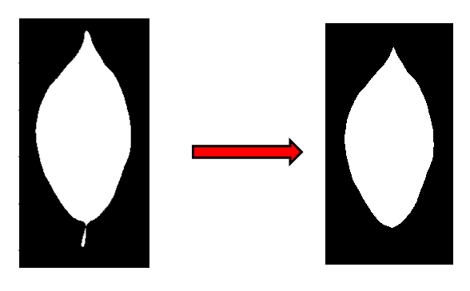
```


**Closing Holes**

|       Closing holes is followed by noise removal technique which demonstrates the closing effect. Closing effect is used to remove small holes inside the foreground objects. Closing holes is a result of morphological transformation. morphological transformation are the operations based on image shape. Binary image is used as one input in morphological transformation. Kernel or structuring element which decides the nature of the operation is used as the second input. There are two morphological operators as Erosion and Dilation. Closing is a variant form of morphological operators which is used in closing holes process. Closing is also know as Dilation followed by Erosion.

**Erosion**

|       The basic idea of Erosion is that erodes away the boundaries of foreground object. Since the input is binary image, a pixels in the original image is either 1 or 0. If all the pixels under the kernel is 1, a pixel of original image is considered as 1, otherwise made to zero (eroded). Which means that depending upon the size of the kernel all pixels near boundary will be discarded. Therefore the thickness or size of the foreground object decreases (White region of the image decreases). 


**Dilation**

|       Opposite of erosion is defined as Dilation. If at least one pixel under the kernel is 1, the pixel element is 1 in Dilation. It tends to increase the foreground of the image or the white region  of the object. 

|       Noise removal is that a technique of erosion is followed by Dilation. In erosion white noise is removed and shrinks the object (dilate) which doesn't come back. But in closing holes approach the white area is increased. 

```{r chl, fig.cap="Closing holes", fig.pos='h!', fig.height = 5, fig.width = 8, out.width="90%", fig.align="center",out.height="20%"}
knitr::include_graphics("Figures/close_holes.png")
```

# Features

## Introduction

|       In identification of plant species by using leaf images, features of the leaves play a main role. In previous research [@articlepl;@article7], let the algorithm like CNN to extract features by itself and do the classification. Therefore it is so hard to interpret and generalize the features. We introduced pre-calculate features which can be easy to interpret and generalize. They are also computational efficient. Mainly we focused on four types of features of leaf images as Shape features, Texture features, Color features and Scagnostics features. We identified altogether 52 features.

\begin{center}
\begin{longtable}{|p{4cm}|p{7cm}|}
\caption{Summary of Features}
\label{tab:sh}\\

\hline \multicolumn{1}{|c|}{\textbf{Class}} & \multicolumn{1}{c|}{\textbf{Features}}  \\ \hline 
\endfirsthead

\multicolumn{2}{c}%
{{\bfseries \tablename\ \thetable{} -- continued from previous page}} \\
\hline \multicolumn{1}{|c|}{\textbf{Class}} & \multicolumn{1}{c|}{\textbf{Features}}  \\ \hline 
\endhead

\hline \multicolumn{2}{|r|}{{Continued on next page}} \\ \hline
\endfoot

\hline \hline
\endlastfoot                                                                                                                                                                                                                                                                                                                                                                                                                                                                                                                                                                                                
Shape Features (21)         & \begin{tabular}[c]{@{}l@{}}1. Diameter\\ 2. Area\\ 3. Perimeter\\ 4. Physiological Length\\ 5. Physiological Width\\ 6. Perimeter Ratio Width\\ 7. Perimeter Ratio Length\\ 8. Perimeter Ratio Diameter \\ 9. Circularity\\ 10. Aspect Ratio\\ 11. Rectangularity\\ 12. Compactness\\ 13. Narrow Factor (NF)\\ 14. Eccentricity\\ 15. Equivalent Diameter\\ 16. Area Convexity\\ 17. Perimeter Convexity\\ 18. x coordinate of Center\\ 19. y coordinate of Center\\ 20. Number of convex points\\ 21. Area Ratio Convexity\end{tabular}                                                                                                                                                                                                                                                                          \\ \hline
Texture Features (4)        & \begin{tabular}[c]{@{}l@{}}1. Contrast\\ 2. Texture Correlation\\ 3. Entropy\\ 4. Inverse Difference Moments\end{tabular}                                                                                                                                                                                                                                                                                                                                                                                                                                                                                                                                                                                                                                                                                         \\ \hline
Color Features (6)          & \begin{tabular}[c]{@{}l@{}}1. Mean of Red value\\ 2. Mean of Blue value\\ 3. Mean of Green value \\ 4. Standard Deviation of Red value\\ 5. Standard Deviation of Blue value\\ 6. Standard Deviation of Green value\end{tabular}                                                                                                                                                                                                                                                                                                                                                                                                                                                                                                                                                                                  \\ \hline
Scangostics Features (21)   & \begin{tabular}[c]{@{}l@{}}1. Outlying of Cartesian coordinate\\ 2. Skewed of Cartesian coordinate \\ 3. Sparse of Cartesian coordinate\\ 4. Clumpy of Cartesian coordinate\\ 5. Striated of Cartesian coordinate\\ 6. Convex of Cartesian coordinate\\ 7. Skinny of Cartesian coordinate\\ 8. Stringy of Cartesian coordinate\\ 9. Monotonic of Cartesian coordinate\\ 10. Outlying of Polar coordinate \\ 11. Skewed of Polar coordinate\\ 12. Sparse of Polar coordinate\\ 13. Clumpy of Polar coordinate\\ 14. Striated of Polar coordinate\\ 15. Convex of Polar coordinate\\ 16. Skinny of Polar coordinate\\ 17. Stringy of Polar coordinate\\ 18. Monotonic of Polar coordinate \\ 19. Number of maximum points\\ 20. Number of minimum points\\ 21. Correlation of cartesian coordinate\end{tabular} \\ \hline
\hline
\end{longtable}
\end{center}


## Shape Features
	
|       When identifying real-world objects, the shape is known as an essential sign for humans. A shape measure is a quantity, which relates to a particular shape characteristic of an object in general [@articlee]. 
	
|       The main geometric transformation are rotation reflection, scaling and translation (see figure \ref{fig:img3}).In my research, the defined shape descriptors/ shape features are invariant to the rotation and reflection. But some limitations are applied in translation and scaling.


```{r img3, fig.cap="Example of geometric transformation", fig.pos='h!', fig.height = 5, fig.width = 8, out.width="90%", fig.align="center"}
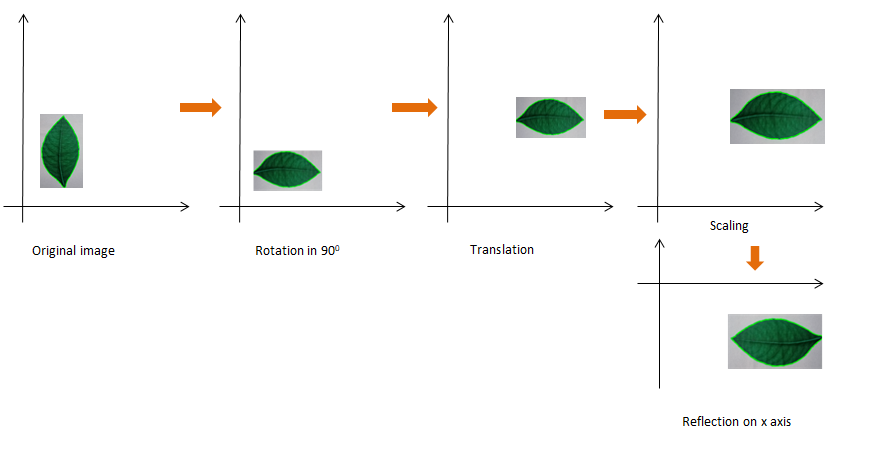
```
   

	

|       The finding contour function doesn’t work when the center of the leaf image is not in the contour. Therefore if the translation is applied away from the contour \ref{fig:trans}, then function can’t identify the contour. Inappropriate scaling (see figure \ref{fig:scal}) also arises problems in the calculation. If the leaf image is really small, the function also hard to recognize the contour. Therefore taking the closest photo of the leaf images by keeping them in the center of the white paper is more suitable.

```{r trans, fig.cap="Inappropriate translation", fig.pos='h!', fig.height = 5, fig.width = 8, out.width="50%",out.height="30%", fig.align="center"}
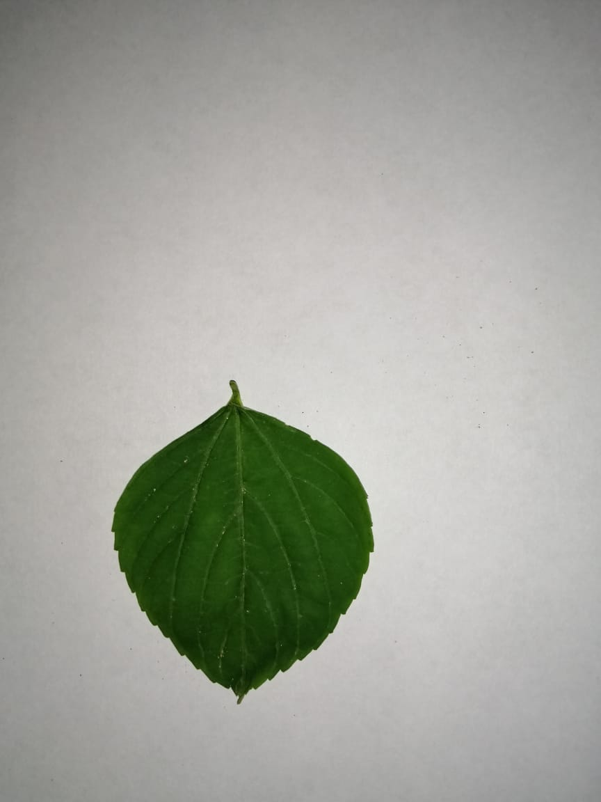
```

```{r scal, fig.cap="Inappropriate scaling", fig.pos='h!', fig.height = 5, fig.width = 8, out.width="50%",out.height="30%", fig.align="center"}
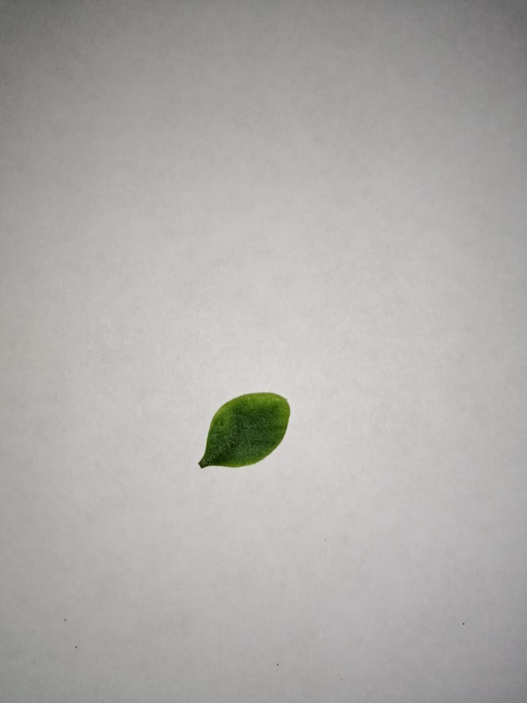
```

	    

### Contours

|       Simply contour (see figure \ref{fig:cnt}) is a curve joining all the continuous points (along the boundary), having the same colour or intensity.


```{r cnt, fig.cap="Extract contour of the leaf image", fig.pos='h!', fig.height = 5, fig.width = 8, out.width="70%", fig.align="center"}
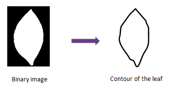
```


|       Shape descriptors can be classified into two main categories as contour-based and region-based. Contour-based descriptors extract shape features solely from the contour of a shape [@articlee]. Whereas, region-based descriptors obtain shape features from the whole region of a shape [@articlee]. In addition, there also exist some methods, which cannot be classified as either contour-based or region-based (see figure \ref{fig:img4}).

```{r img4, fig.cap="Categorization of shape features", fig.pos='h!', fig.height = 5, fig.width = 8, out.width="70%", fig.align="center"}
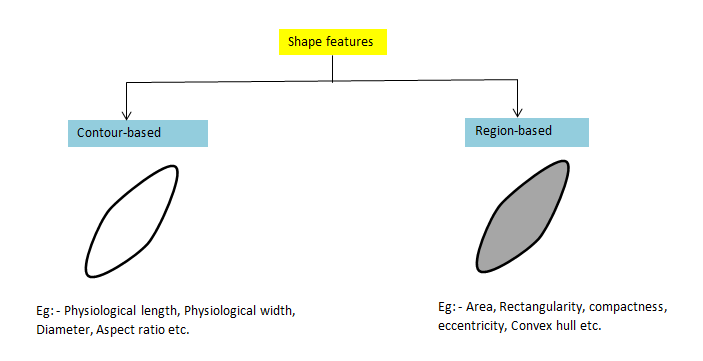
```


|       Through this research, we restricted our research to the following shape features to identify leaf images (see \ref{tab:table1}).

## Diameter
|       Diameter is defined as the longest distance between any two points on the margin of the leaf [@articlee].

|       To calculate the diameter of the leaf image, firstly we have to find the contour of the leaf image. Then we have to select all pair of contour points and measure the Euclidean distance (\ref{eq:equa_shape}) between the two points separately. Finally have to find the maximum distance among the calculated distances. (see figure \ref{fig:shape1}) 

\begin{equation}
    d\left( A,B\right)   = \sqrt {\sum _{i=1}^{n}  \left( q_{i}-p_{i}\right)^2 }
\label{equa_shape}
\end{equation}


```{r shape1, fig.cap="Logic behind calculation of diameter", fig.pos='h!', fig.height = 5, fig.width = 8, out.width="70%", fig.align="center"}
knitr::include_graphics("Figures/d_cal.png")
```


## Physiological length and Physiological width

|       There are horizontal, vertical and rotated leaf images in the datasets (Flavia, Swedish, Actual and Kaggle). Kaggle leaf image dataset is only consist of horizontal and vertical leaf images. Therefore straight bounding rectangle is enough to extract Physiological length and Physiological width of leaf images.


```{r act3, fig.cap="Straight(Horizontal or vertical) and rotated leaf image in Actual leaf image dataset", fig.pos='h!', fig.height = 5, fig.width = 8, out.width="70%", fig.align="center"}
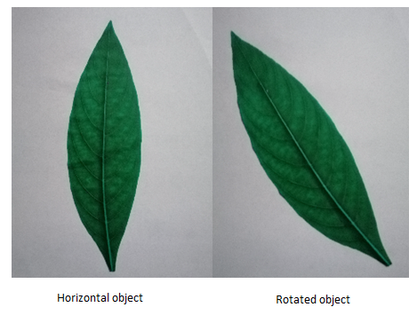
```


```{r kgbd7, fig.cap="Physiological length and Physiological width of leaf image in Kaggle image dataset", fig.pos='h!', fig.height = 5, fig.width = 8, out.width="70%", fig.align="center"}
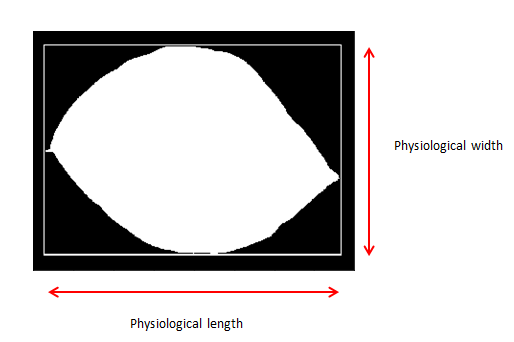
```

	    
|       But straight bounding rectangle of rotated image doesn't give the correct values for Physiological length and Physiological width of leaf images.


```{r act1, fig.cap="Bounded rectangle of rotated leaf image in Actual leaf image dataset", fig.pos='h!', fig.height = 5, fig.width = 8, out.width="70%", fig.align="center"}
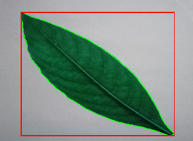
```


|       To solve this problem, we considered rotated rectangle rather than bounded rectangle in computing shape features of angled images.


```{r act2, fig.cap="Rotated rectangle of angled leaf image in Actual leaf image dataset", fig.pos='h!', fig.height = 5, fig.width = 8, out.width="70%", fig.align="center"}
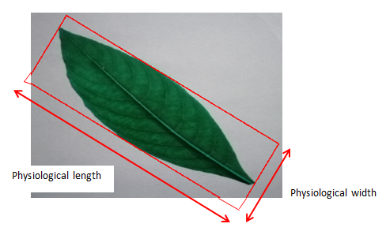
```


|       There are two types of bounding rectangles.

    * Straight Bounding Rectangle

|       This is a straight rectangle which doesn't consider the rotation of the object. Therefore area of the bounding rectangle doesn't minimize.


    * Rotated Rectangle 


|       This bounding rectangle is drawn with minimum area. Therefore the rotation of the object is also considered. 


## Area

```{r shape3, fig.cap="Area", fig.pos='h!', fig.height = 5, fig.width = 8, out.width="70%", fig.align="center"}
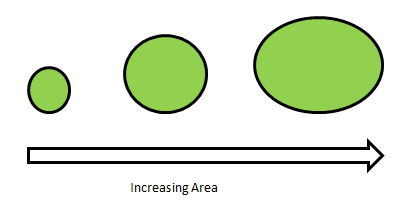
```


## Roundness/ Circularity

```{r shape4, fig.cap="Circularity", fig.pos='h!', fig.height = 5, fig.width = 8, out.width="70%", fig.align="center"}
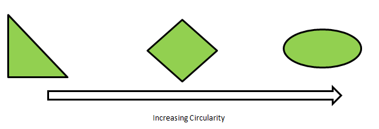
```


## Compactness


```{r shape5, fig.cap="Compactness", fig.pos='h!', fig.height = 5, fig.width = 8, out.width="70%", fig.align="center"}
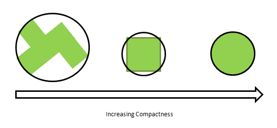
```


## Eccentricity


```{r shape6, fig.cap="Eccentricity", fig.pos='h!', fig.height = 5, fig.width = 8, out.width="70%", fig.align="center"}
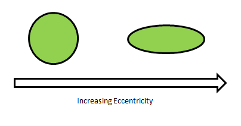
```


```{r shape7, fig.cap="Ellipse", fig.pos='h!', fig.height = 5, fig.width = 8, out.width="70%", fig.align="center"}
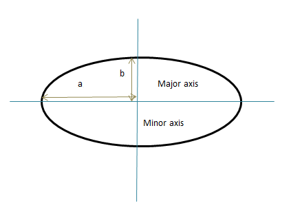
```


\begin{equation}
    Eccentricity = \sqrt{1-\frac{b^2}{a^2}}
\end{equation}

## Convexity

```{r shape8, fig.cap="Convexity", fig.pos='h!', fig.height = 5, fig.width = 8, out.width="70%", fig.align="center"}
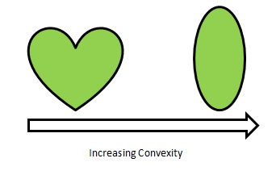
```


## Convex hull

|       The more details about convex hull can be found in the convex hull under scagnostics features.

## Number of Minimum and Maximum Points


```{r mn, fig.cap="Minimum and Maximum Points", fig.pos='h!', fig.height = 5, fig.width = 8, out.width="70%", fig.align="center"}
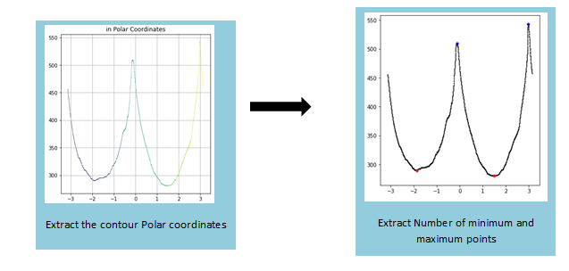
```


\begin{center}
\begin{longtable}{|p{4cm}|p{6.5cm}|p{3cm}|p{3cm}|}
\caption{Definitions of shape features}
\label{table1}\\

\hline \multicolumn{1}{|c|}{\textbf{Shape feature}} & \multicolumn{1}{c|}{\textbf{Description}} & \multicolumn{1}{c|}{\textbf{Pictogram}} & \multicolumn{1}{c|}{\textbf{Formula}} \\ \hline 
\endfirsthead

\multicolumn{4}{c}%
{{\bfseries \tablename\ \thetable{} -- continued from previous page}} \\
\hline \multicolumn{1}{|c|}{\textbf{Shape feature}} & \multicolumn{1}{c|}{\textbf{Description}} & \multicolumn{1}{c|}{\textbf{Pictogram}} & \multicolumn{1}{c|}{\textbf{Formula}} \\ \hline 
\endhead

\hline \multicolumn{4}{|r|}{{Continued on next page}} \\ \hline
\endfoot

\hline \hline
\endlastfoot

Centroid                                                                                                         & \begin{tabular}[c]{@{}l@{}}Represents the coordinates \\ of the leaf's geometric center\end{tabular}                                           &   \centering\includegraphics[scale=0.5]{./Figures/centroid.png}        &                                                                                      \\ \hline
\begin{tabular}[c]{@{}l@{}}Physiological length/ \\ Major axis length (L)\end{tabular}                           & \begin{tabular}[c]{@{}l@{}}Line segment connecting the \\ base and the tip of the leaf\end{tabular}                                            &     \centering\includegraphics[scale=0.5]{./Figures/Length_new.png}      &                                                                                      \\ \hline
\begin{tabular}[c]{@{}l@{}}Physiological width/ \\ Minor axis length (W)\end{tabular}                            & \begin{tabular}[c]{@{}l@{}}Maximum width that is \\ perpendicular to the major axis\end{tabular}                                               &    \centering\includegraphics[scale=0.5]{./Figures/width.png}       &                                                                                      \\ \hline
Diameter (D)                                                                                                     & \begin{tabular}[c]{@{}l@{}}Longest distance between any two \\ points on the margin of the origin\end{tabular}                                 &   \centering\includegraphics[scale=0.5]{./Figures/dimameter.png}        &                                                                                      \\ \hline
Area (A)                                                                                                         & \begin{tabular}[c]{@{}l@{}}Number of pixels in the region \\ of the leaf\end{tabular}                                                          &   \centering\includegraphics[scale=0.5]{./Figures/area.png}        &                                                                                      \\ \hline
Perimeter (P)                                                                                                    & \begin{tabular}[c]{@{}l@{}}Summation of the distance \\ between each adjoining pair of \\ pixels around the border of the leaf\end{tabular}    &   \centering\includegraphics[scale=0.5]{./Figures/perimeter.png}        &                                                                                      \\ \hline
Aspect ratio (AR)                                                                                                & \begin{tabular}[c]{@{}l@{}}Ratio of physiological length to \\ physiological width\end{tabular}                                                & \centering\includegraphics[scale=0.5]{./Figures/AR.png}           & \[AR = \frac{L}{W}\]                                              \\ \hline 
\begin{tabular}[c]{@{}l@{}}Roundness/\\ Circularity (R)\end{tabular}                                                                                       & \begin{tabular}[c]{@{}l@{}}Illustrate the difference between \\ a leaf and a circle\end{tabular}                                               &   \centering\includegraphics[scale=0.5]{./Figures/roudness.png}        & \[R = \frac{4 \pi A}{P^2}\]       \\ \hline
Compactness                                                                                                      & \begin{tabular}[c]{@{}l@{}}Ratio of the perimeter over \\ the leaf's area\end{tabular}                                                         &   \centering\includegraphics[scale=0.5]{./Figures/rect.png}        & \[C = \frac{P^2}{A}\]                            \\ \hline
Rectangularity (N)                                                                                               & \begin{tabular}[c]{@{}l@{}}Represents how rectangle a shape is,\\ i:e: how much it fits its minimum \\ bounding rectangle\end{tabular}         &           & \[N = \frac{A}{LW}\]                                              \\ \hline
Eccentricity (E)                                                                                                 & \begin{tabular}[c]{@{}l@{}}Ratio of the distance between foci \\ of the ellipse (f) and major \\ axis length (a)\end{tabular}                  &           & \[E = \frac{f}{a}\]                                               \\ \hline
Narrow factor (NF)                                                                                               & \begin{tabular}[c]{@{}l@{}}Ratio of the diameter over the \\ physiological length\end{tabular}                                                 & \centering\includegraphics[scale=0.5]{./Figures/nf.png}          & \[NF = \frac{D}{L}\]                                              \\ \hline
\begin{tabular}[c]{@{}l@{}}Perimeter ratio of \\ diameter ($P_{D}$)\end{tabular}                                 & Ratio of the perimeter to the dimeter                                                                                                          &  \centering\includegraphics[scale=0.5]{./Figures/pd.png}         & \[P_D = \frac{P}{D}\]                                           \\ \hline
\begin{tabular}[c]{@{}l@{}}Perimeter ratio of \\ Major axis length ($P_{L}$)\end{tabular}                        & \begin{tabular}[c]{@{}l@{}}Ratio of the perimeter to the \\ physiological length\end{tabular}                                                  &  \centering\includegraphics[scale=0.5]{./Figures/pl.png}         & \[P_L = \frac{P}{L}\]                                            \\ \hline
\begin{tabular}[c]{@{}l@{}}Perimeter ratio of \\Major axis length and \\ Minor axis \\length ($P_{LW}$)\end{tabular} & \begin{tabular}[c]{@{}l@{}}Ratio of the leaf perimeter over the \\ sum of the physiological length and \\ the physiological width\end{tabular} &  \centering\includegraphics[scale=0.5]{./Figures/plw.png}          & \[P_{LW} = \frac{P}{L + W}\]                                   \\ \hline
Number of convex points                                                                                          & \begin{tabular}[c]{@{}l@{}}Number of points to create a \\ convex hull\end{tabular}                                                            &  \centering\includegraphics[scale=0.5]{./Figures/convex.png}         &                                                                                      \\ \hline
Perimeter convexity ($P_{C}$)                                                                                    & \begin{tabular}[c]{@{}l@{}}Ratio of the convex perimeter to the \\ perimeter of the leaf\end{tabular}                                          & \centering\includegraphics[scale=0.5]{./Figures/p_con.png}          & \[P_C = \frac{P_{CH}}{P}\]                                    \\ \hline
Area convexity ($A_{C1}$)                                                                                        & \begin{tabular}[c]{@{}l@{}}Normalized difference of the convex \\ hull area and the leaf's area\end{tabular}                                   & \centering\includegraphics[scale=0.5]{./Figures/a_c1.png}          & \[A_{C1} = \frac{(CH-A)}{A}\]                                  \\ \hline
Area ratio of convexity ($A_{C2}$)                                                                               & \begin{tabular}[c]{@{}l@{}}Ratio between leaf's area and area \\ of the leaf's convex hull\end{tabular}                                        &    \centering\includegraphics[scale=0.5]{./Figures/a_c2.png}       & \[A_{C2} = \frac{A}{CH}\]                                      \\ \hline
Equivalent diameter ($D_{E}$)                                                                                    & \begin{tabular}[c]{@{}l@{}}Diameter of a circle with the the \\ same area as the leaf's area\end{tabular}                                      &  \centering\includegraphics[scale=0.5]{./Figures/eq_d.png}         & \[D_E = \sqrt{\frac{4*A}{\pi}}\] \\

\end{longtable}
\end{center}


## Color Features
	
|       Colour is an important feature of images [@articlee]. Colour properties are defined within a particular colour space like red-green-blue (RGB) [@articlee]. Colour properties can be extracted from images after a colour space is specified. In the field of image recognition, a number of general colour descriptors have been introduced. Colour moments [@articlee] are the simple descriptor among them. Mean, standard deviation skewness and kurtosis are the comment moments. Colour moments are used for characterizing planar colour patterns, irrespective of viewpoint or illumination conditions and without the need for object contour detection [@articlee]. Colour moments are convenient for real-time applications because of its low dimension and low computational complexity. 
	
|       Some of leaf images have very similar shape like Hathawariya (\ref{fig:Hatha}) and Iramusu (\ref{fig:Ira}) in our experiment. Even though shapes are similar in some leaves, there are some differences in colours of leaf images. Therefore in addition to the shape features, we extracted colour based features of leaf images as well.


```{r Hatha, fig.cap="Hathawariya", fig.pos='h!', fig.height = 5, fig.width = 8, out.width="70%", fig.align="center",out.height="30%"}
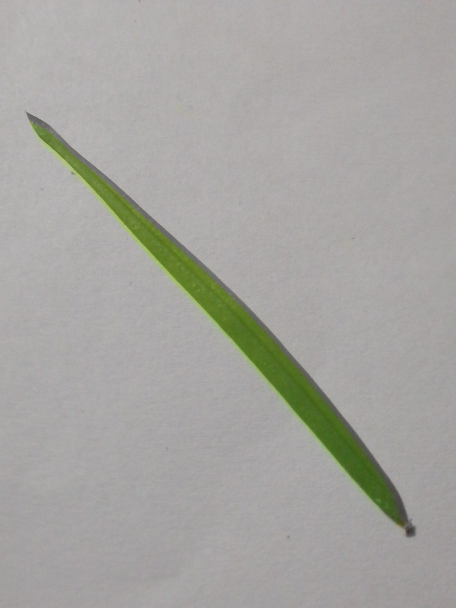
```

```{r Ira, fig.cap="Iramusu", fig.pos='h!', fig.height = 5, fig.width = 8, out.width="70%",out.height="30%", fig.align="center"}
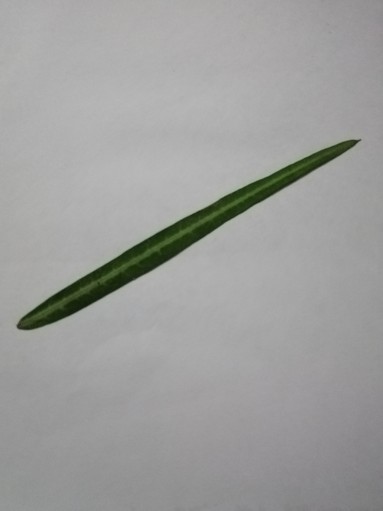
```


|       We used mean ($\mu$) and standard deviation ($\sigma$) of intensity values of red, green and blue channels [@inproceedings1]. Mean and standard deviation of each component are calculated as follows:

## Texture Features
	
|       Texture is the term used to describe the surface of a given object or appearance and is undoubtedly a main feature used in computer vision and pattern recognition [@articlee]. Texture can only be assessed for a group of pixels whereas colour is usually a property of a pixel. Generally, texture is associated with the feel of various materials to human touch and texture image analysis is based on visual interpretation [@articlee] of this feeling. Leaf surface is a natural texture which has random persistent patterns and do not show detectable quasi-periodic structure [@articlee]. Therefore, several authors claim fractal theory to be better suited than statistical, spectral, and structural approaches for describing these natural textures [@articlee].
	
|       The Haralick texture features [@article31; @article30] are functions of the normalized GLCM (Gray Level co-occurrence Matrix) which is a common method to represent image texture. 
  
  
    
$$\mathbf{GLCM} = \left[\begin{array}
{rrrrrr}
p(1,1) & p(1,2)  & \cdot &\cdot &\cdot & p(1,N_{g}) \\ 
p(2,1) & p(2,2)  & \cdot &\cdot &\cdot & p(2,N_{g}) \\ 
\cdot  & \cdot & \cdot  & & &\cdot\\ 
\cdot  & \cdot &  & \cdot& &\cdot\\ 
\cdot  & \cdot &  & & \cdot &\cdot\\ 
p(N_{g},1) & p(N_{g},2) & \cdot &\cdot &\cdot & p(N_{g},N_{g})
\end{array}\right]$$


    
    
|       The GLCM is square with dimension $N_{g}$, where $N_{g}$ is the number of gray levels in the image [@article31]. Element [i,j] of the matrix is generated by counting the number of times a pixel with value i is adjacent to a pixel with value j and then dividing the entire matrix by the total number of such comparisons made [@article31]. Therefore each entry is considered to be the probability (see figure \ref{fig:img1}) that a pixel with value i will be found adjacent to a pixel of value j [@article31].  Four such matrices can be calculated, because adjacency can be defined to occur in each of four directions in a 2D (see figure \ref{fig:img2}), square pixel image (horizontal, vertical, left and right diagonals - see equation \ref{fig:direction}) [@article31].
    

```{r direction, fig.cap="Four directions of adjacency as defined for calculation of the Haralick texture features", fig.pos='h!', fig.height = 5, fig.width = 8, out.width="70%",out.height="30%", fig.align="center"}
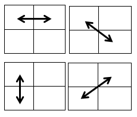
```

|       The Haralick statistics are calculated for co-occurrence matrices generated using each of these directions (see figure \ref{fig:img1}) of adjacency [@article31]. Haralick then described 14 statistics that can be calculated from the co-occurrence matrix with the intent of describing the texture of the image. Through the research, we only used the following 4 statistics among 14 of them, because most of the researchers used these 4 statistics as texture features (see figure \ref{tab:my-table}) of leaf images.

where p(i, j) = Probability density function of gray - level pairs
	
	$$\mu_{x} = \sum_{i}^{}i\sum_{j}^{}p(i,j) \\
	
	\mu_{y} = \sum_{j}^{}j\sum_{i}^{}p(i,j) \\
	
	\sigma_{x} = \sum_{i}^{}(i-\mu_{x})^2\sum_{j}^{}p(i,j)\\
	
	\sigma_{y} = \sum_{j}^{}(j-\mu_{y})^2\sum_{i}^{}p(i,j)$$
	

    
	    
```{r img1, fig.cap="puting the Haralick texture features from a 4 × 4 example image step by step", fig.pos='h!', fig.height = 5, fig.width = 8, out.width="80%",out.height="40%", fig.align="center"}
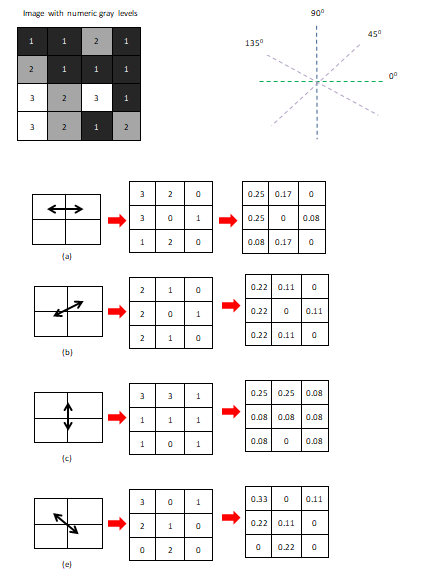
```

```{r img2, fig.cap="Computing the Haralick texture features from a 4 × 4 example image with all direction", fig.pos='h!', fig.height = 5, fig.width = 8, out.width="70%",out.height="30%", fig.align="center"}
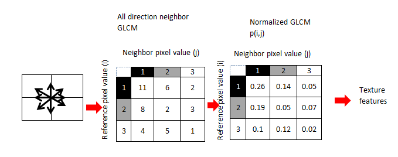
```


## Scagnostics Features
	
|       Scatterplot diagnostics is a term in Tukey neologism for scagnostics. Scagnostics are characterizations of the 2D distributions of orthogonal pairwise projections of a set of points in multidimensional Euclidean space [@article37]. Measures like density, skewness, shape, outliers, and texture are included in these characterizations.
	
|       There are two people who popular in the discussion about scagnostics. John and Paul Tukey, and Wilkinson et al. introduce their ideas about scagnostics in two angles. In first place mid of 1980s, an exploratory graphical method called scagnostics was introduced by John and Paul Tukey. A set of measures characterizing a 2D scatterplot was the base of this method. But John and Paul Tukey were never published their ideas.
	
|       After some years later, the details collected from the first author's recollection of Institute for Mathematics and its Applications (IMA) and some discussions with Paul Tukey, Wilkinson et al. (2005) developed nine scagnostics measures efined on planar proximity graphs [@article37]. These measures were scalable to large datasets and therefore suitable for practical applications [@article37].
	
|       Wilkinson et al. was introduced nine scagnostics measures which determined the cells of scatter plot matrix (SPLOM). SPLOM means that the organization of scatterplots in the layout of a covariance matrix. In here the scatterplots are of the scagnostics measures.
	
|       By characterizing a large collection of 2D scatterplots through a small number of measures like the area of the peeled convex hull (Tukey 1974), the perimeter length of this hull, the area of closed 2D kernel density isolevel contours (Silverman 1986), the perimeter length of these contours, and a nonlinearity measure of association based on principal curves (Hastie and Stuetzle 1989) of the arrangement of points in these plots was proposed by Tukeys [@article37]. This was a simple and powerful idea, but when implementing many details wanted to involve.
	
|       Wilkinson et al. proposed his method by including the criteria that should met by candidate scagnostics.


	    1. Distinguish many types of point distributions: multivariate normal, 
	    lognormal, multinomial, sparse, dense, convex, clustered, etc.
	    
	    2. A small number of scagnostics characterizing these distributions.
	    
	    3. Should have a common scale because want to compare them with each other.
	    
	    4. Should have a comparable distribution because want to compare them 
	    to standard.
	    
	    5. The intrinsic dimensionality of these scagnostics, when calculated
	    over a large number of heterogeneous scatterplots, to be as large as possible.
	    
	    6. To be efficiently computable because the scagnostics should be scalable
	    to large numbers of points and dimensions.


```{r scagimg, fig.cap="Hierarchy of Scagnostics", fig.pos='h!', fig.height = 5, fig.width = 8, out.width="70%",out.height="30%", fig.align="center"}
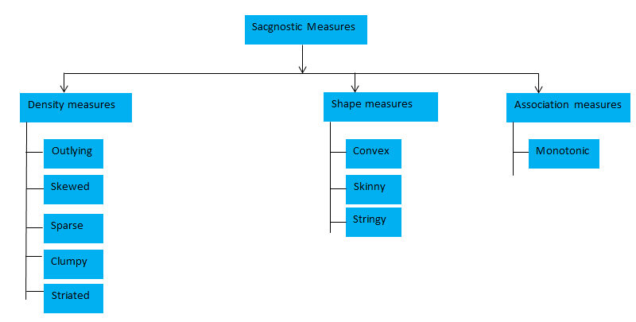
```	    
	    

Scagnostic measures are based on following definitions.

### Geometric Graphs


    * Graph
 

|       A graph G = (V, E) is defined as a set V (called vertices) together with a relation on V induced by a set E (called edges). A pair of vertices is defined as an edge $e(\nu,\omega)$, with e $\in$ E and $\nu,\omega \in$ V.


    * Geometric Graph


|       An embedding of a graph in a metric space S that maps vertices to points and edges to straight line segments connecting pairs of points is defined as a geometric graph G* = [f(V), g(E), S].

|       From several features of 2D Euclidean geometric graphs, Scagnostic measures are derived.

|       The Euclidean distance between vertices that connected to edge is defined as the length of an edge, length(e).

|       The sum of the lengths of edges in graph is known as the length of a graph, length(G).

|       A list of successively adjacent, distinct edges are known as a path. If first and last vertex are the same of the path, then the path is closed.

|       A region bounded by a closed path is known as a polygon (P). A polygon bounded by exactly one closed path that has no intersecting edges is known as a simple polygon.

|       The length of boundary of a simple polygon is known as the perimeter of a simple polygon. The area of interior of a simple polygon is known as the area of a simple polygon.


```{r scagimg5, fig.cap="Graph with 5 vertices and 5 edges", fig.pos='h!', fig.height = 5, fig.width = 8, out.width="70%",out.height="30%", fig.align="center"}
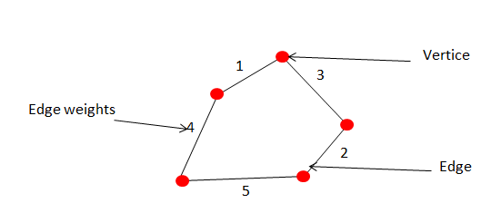
```	  


### Minimum Spanning Tree (MST)

* Tree

|       A graph in which any two nodes are connected by exactly one path is known as a *tree*.


* Spanning Tree
 

|       An undirected graph whose edges are structured as a tree is defines as a *Spanning Tree*.

**Spanning Tree of Graph G is:** G'(V',E')

\begin{equation*}
    V' = V
\end{equation*}

\begin{equation*}
    E' \subset E
\end{equation*}

\begin{equation*}
    E' = |V|-1
\end{equation*}

The graph can have more than one spanning tree.

|       Spanning tree should not be disconnected and not contain any cycle. By removing one edge from the Spanning tree will make it disconnected. By adding one edge to the Spanning tree will create a loop. A complete (Each vertices connected with each other) undirected graph can have $n^{n-2}$ number of spanning trees where n is the number of vertices. Every connected and undirected graph has at least one Spanning Tree. Disconnected graph doesn't have any spanning tree. From a complete graph by removing $max(edges-n+1)$ edges we can construct a spanning tree.


* Minimum Spanning Tree

|       A spanning tree whose total length is least of all spanning trees on a given set of points is known as a Minimum Spanning Tree (MST).

|       If each edge has distinct weights then there will be only one and unique MST.

* Remark
 

The geometric MST computed from Euclidean distances between points in a 2D Euclidean geometric graph is the restriction.

## Convex Hull

|       A collection of the boundaries of one or more simple polygons that have a subset of the points for their vertices and that collectively contain all the points, is defined as a hull of a set of points embedded in 2D Euclidean space. 

|       If a hull contains all the straight line segments connecting any pair of points in its interior, is known as a convex hull. The convex hull bounds a single polygon. After deleting the points on the convex hull, a convex hull called peeled convex hull is computed. 

## Alpha Hull

|       Most of proximity graphs (neighbourhood graph) represent the nonconvex shape of a set of points on the plane. A geometric graph whose edges are determined by an indicator function based on distances between a given set of points in a metric space, is known as a proximity graph. An open disk $D$ is used to define the indicator function.

|       If a point is on the boundary of $D$ then $D$ *touches* a point and if a point is in $D$ then $D$ *contains* a point. An open disk of radius r is defined as $D(r)$. 


|       An alpha shape is a collection of one or more simple polygons [@article37]. An edge exists between any pair of points that can be touched by an open disk $D(\alpha)$ containing no points, is defined as an alpha shape graph.

|       A value of $\alpha$ to be the average value of the edge lengths in the MST [@article37]. The large values like 90th percentile of the MST edge lengths are used, because to reduce noise. If the percentile exceeds a tenth, clamp the value at one-tenth the width of a frame, because it prevents in including sparse or striated point sets in a single alpha graph. 


```{r scagimg4, fig.cap="Convex hull and alpha hull", fig.pos='h!', fig.height = 5, fig.width = 8, out.width="70%",out.height="30%", fig.align="center"}
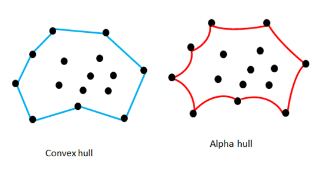
```	 

## Preprocessing

|       To improve the performance of the algorithm and robustness of the measures, preprocessing techniques as binning and deleting outliers are used before computing geometric graphs.

* Binning

|       As the first step of binning, the data are normalized to the unit interval. Then use a 40 by 40 hexagonal grid to aggregate the points in each scatterplot. Reduce the bin size by half and rebin until no more than 250 non emty cells, if there are more than 250 non empty cells. By efficiency (too many bins slow down calculations of the geometric graphs) and sensitivity (too few bins obscure features in the scatterplots), the choice of bin size is constrained. 

|       To improve the performance, hexagon binning is used. To manage the problem of having to many points that start to overlap, hexagon binning is used. The plots of hexagonal binning are density rather than points. To use hexagons instead of squares for binning a 2D surface as a plane, there are many reasons. Hexagons are more similar to circle than square. 

|       To keep scagnostics orientation-independent this bias reduction is important. To attenuate the influence of binning, stabilizing transformation is used when computing scagnostics from binned data.

The weight function is defined as;

\begin{equation}
    \omega = 0.7 + \frac{0.3}{1 + t^2}
    \label{w2}
\end{equation}
 
where $t=\frac{n}{500}$. ($n$ is the number of vertex)

|       If $n>2000$ then this function is fairly constant. By using hex binning the shape and the parameters of the function is determined. In computing Sparse, Skewed and Convex scagnostics this weight function is used to adjust for bias.   

* Deleting Outliers

|       To improve robustness of the scagnostics, deleting outliers can be used. A vertex whose adjacent edges in the MST all have a weight (length) greater than $\omega$ is defined as an outlier in this context. By considering nonparametric criterion for the simplicity and Tukey's idea choose the following weight calculation.

\begin{equation}
    \omega = q_{75} + 1.5(q_{75} - q_{25})
    \label{w1}
\end{equation}

where $q_{75}$ is the 75th percentile of the MST edge lengths and $(q_{75} - q_{25})$ is the Interquartile range of the edge lengths. 


## Degree of a Vertex

|       The degree of a vertex in an undirected graph is know as the number of edges associated with the vertex.

**Eg:- Vertices of degree 2** There are 2 edges associated with each vertex.

```{r scagimg51, fig.cap="Vertices of degree 2", fig.pos='h!', fig.height = 5, fig.width = 8, out.width="70%",out.height="30%", fig.align="center"}
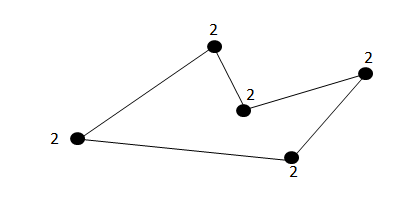
```	


\begin{table}
\centering
\begin{tabular}{|l|c|}
\hline
\multicolumn{1}{|c|}{Geometric Graphs} & Notation \\ \hline
Convex Hull                            & H        \\ \hline
Alpha Hull                             & A        \\ \hline
Minimum Spanning Tree                  & T        \\ \hline
\end{tabular}
\caption{Notations of Geometric Graphs}
\label{tab:gg}
\end{table}

## Density Measures

|       Detect different distributions of scattered points in density measures.

* Outlying

\begin{equation}
    C_{outlying} = \frac{length(T_{outliers})}{length(T)}
\end{equation}

|       The outlying measure calculate before deleting the outliers for the other measures. The proportion of the total edge length of the minimum spanning tree accounted for by the total length of edges adjacent to outlying points is used to calculate the outlying measure.


* Skewed

\begin{equation}
    q_{skew} = \frac{q_{90}-q_{50}}{q_{90}-q_{10}}
\end{equation} 

\begin{equation}
    C_{skew} = 1-\omega(1-q_{skew})
\end{equation}

where $\omega$ is the weight function (\ref{eq:w2}).

|       The skewed measure is the first measure of relative density which is a relatively robust measure of skewness in the distribution of edge lengths. After adaptive binning skewed tends to decrease with $n$.


* Sparse

\begin{equation}
    C_{sparse} = \omega q_{90}
\end{equation} 

where $\omega$ is the weight function (\ref{eq:w2}) and $q_{90}$ is the 90th percentile of the distribution of edge lengths in the MST.

|       The second relative density measure is Sparse measure that measures whether points in a 2D scatterplot are confined to a lattice or a small number of locations on the plane.

|       If the number of points is extremely small or tuples are produced by the product of categorical variables, then sparse can be happen.

\begin{equation}
    q_{90} = \alpha statistic
\end{equation} 

|       The $\alpha$ statistic exceeds unity (e.g., when all points fall on either of the two diagonally opposing vertices of a square), clamp the value to 1 in the extremely rare event [@article37].

* Clumpy


\begin{equation}
    C_{clumpy} = max_j[1-\frac{max_k[length(e_k)]}{length(e_j)}]
\end{equation} 

|       Clustering points are not indicated by an extreme distribution of MST edge lengths. Therefore RUNT statistic [@article37] which is another measure based on the MST, is introduced. The smaller of the number of leaves of each of the two subtrees joined at that node isdefined as the runt size of a dendogram node. There is an association between runt size ($r_j$) each edge ($e_j$) in the MST because there is an isomorphism between a single-linkage dendrogram and the MST.

|       The smaller of the two subsets of edges that are still connected to each of the two vertices in $e_j$ after deleting edges in the MST with lengths less than length($e_j$), is known as the RUNT graph ($R_j$) [@article37].

|       The RUNT-based measure responds to clusters with small maximum intracluster distance relative to the length of their nearest-neighbor inter-cluster distance [@article37]. In the formula j runs over all edges in MST and k runs over all edges in RUNT graph.


* Striated

\begin{equation}
    C_{striated} = \frac{1}{|V|}\sum_{\nu \in V^{(2)}}^{}I(\cos\theta_{e(\nu,a)e(\nu,b)}<-0.75)
\end{equation} 

where $V^{(2)} \subseteq V$ and $I()$ be an indicator function.

|       Striated define the coherence in a set of points as the presence of relatively smooth paths in the minimum spanning tree. 
The measure is based on the number of adjacent edges whose cosine is less than minus 0.75.

## Shape Measures

|       Both topological and geometric aspects of shape of a set of scattered points is considered. As an example, a set of scattered points on the plane appeared to be connected, convex and so forth, want to know under the shape measures. By definition scattered points are not like this. Therefore to make inferences additional machinery (based on geometric graphs) is needed. By measuring the aspects of the convex hull, the alpha hull, and the minimum spanning tree is determined.  


* Convex

\begin{equation}
    C_{convex} = \omega[area(A)/area(H)]
\end{equation}

where $\omega$ is the weight function (\ref{eq:w2}).

|       The ratio of the area of the alpha hall(A) and the area of the convex hull(H) is the base of measuring convexity. 


```{r scagimg21,  fig.pos='h!', fig.height = 5, fig.width = 8, out.width="70%",out.height="30%", fig.align="center"}
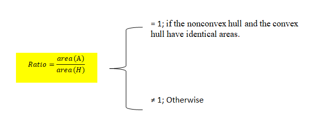
```	 

* Skinny


\begin{equation}
    C_{skinny} = 1- \frac{\sqrt{4\pi area(A)}}{perimeter(A)}
\end{equation}

|       Roughly, the skinny is measured by using the corrected and normalized ratio of perimeter to area of a polygon measures.

```{r scagimg31, fig.pos='h!', fig.height = 5, fig.width = 8, out.width="70%",out.height="30%", fig.align="center"}
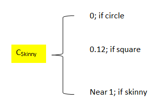
```	

* Stringy
	    

\begin{equation}
    C_{stringy} = \frac{|V^{(2)}|}{|V| - |V^{(1)}|}
\end{equation} 

where $V$ is the number of vertices.

|       A skinny shape with no branches is known as a stringy shape. By counting the vertices of degree 2 in the minimum spanning tree and comparing them to the overall number of vertices minus the
number of single-degree vertices, skinny measure is calculated.

|       To adjust for negative skew in its conditional distribution of $n$, cube the stringy measure. 


## Association Measure

|       Symmetric and relatively robust measure of association are interested.


* Monotonic


\begin{equation}
    C_{monotonic} = r^2_{Spearman}
\end{equation}

|       To assess the monotonicity in a scatter plot, the squared spearman correlation coefficient is used. This is the only coefficient not based on a subset of the Delaunay graph [@article37].

|       In calculating monotonicity, squared the coefficient because to consider the large values and to remove the distinction between positive and negative coefficients (Because assume that the investigators are more interested in strong relationships rather than negative or positive).
	

```{r scagnostics, fig.cap="Exploring scatter plots by their scagnostics", fig.pos='h!', fig.height = 5, fig.width = 8, out.width="70%",out.height="30%", fig.align="center"}
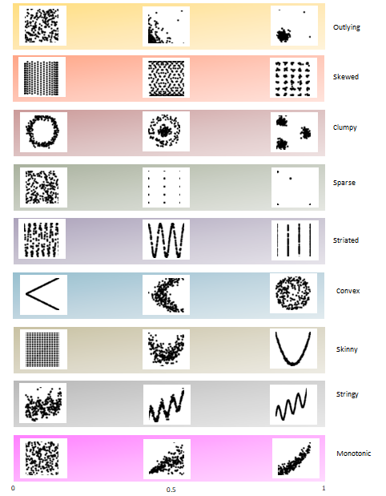
```	


```{r scp, fig.cap="Preprocessing for Scagnostics", fig.pos='h!', fig.height = 5, fig.width = 8, out.width="70%",out.height="30%", fig.align="center"}
knitr::include_graphics("Figures/scp.png")
```	

|       We measured the scagnostic features for Cartesian and Polar coordinates separately.


```{r pc, fig.cap="Polar coordinate", fig.pos='h!', fig.height = 5, fig.width = 8, out.width="70%",out.height="30%", fig.align="center"}
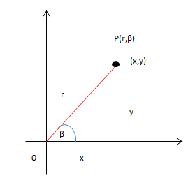
```	

## Examples

### Example 1: Kaggle leaf image dataset

|       Kaggle leaf image dataset consists of binary images (see figure \ref{fig:bin1}) which only has black and white. The background of these images are black and the foreground is white. 

```{r bin1, fig.cap="Leaf image in Kaggle image dataset", fig.pos='h!', fig.height = 5, fig.width = 8, out.width="70%",out.height="30%", fig.align="center"}
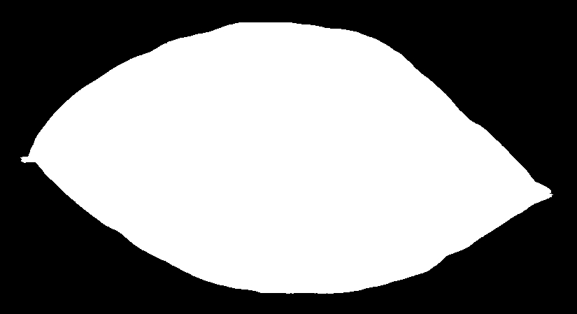
```


|       Even though, have to go through some initial image processing steps. One reason is that the find contour function in OpenCV of python supports only CV\_8UC1. This means that the find contour function supports only for grayscale images (see figure \ref{fig:kgGray}). Therefore grayscaling step has to be followed by Kaggle leaf images.


```{r kgGray, fig.cap="Grayscaled leaf image in Kaggle image dataset", fig.pos='h!', fig.height = 5, fig.width = 8, out.width="70%",out.height="30%", fig.align="center"}
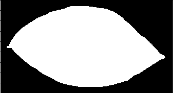
```

|       Also, the .jpg format images may introduce some artefacts that may not necessary. To remove them, binary thresholding (see figure \ref{fig:kgBinary}) can be applied. 


```{r kgBinary, fig.cap="Binary leaf image in Kaggle image dataset", fig.pos='h!', fig.height = 5, fig.width = 8, out.width="70%",out.height="30%", fig.align="center"}
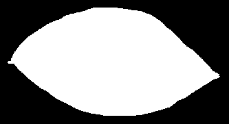
```

The leaf images have different sizes which means that the width and height of the images are different. Therefore have to resize them (see figure \ref{fig:kgre}) in the same format by using the resizing step.


```{r kgre, fig.cap="Resized leaf image in Kaggle image dataset", fig.pos='h!', fig.height = 5, fig.width = 8, out.width="70%",out.height="30%", fig.align="center"}
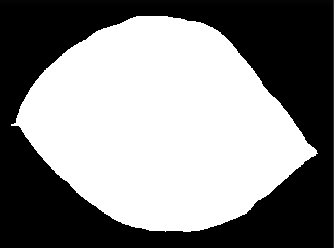
```

|       The leaf images are taken as the closest ones. Therefore to find the best contour among several contours, can use the contour which contains the center of leaf image (see figure \ref{fig:kgce}). But this method does not work for the leaf which was bent (see figure \ref{fig:kg1}). In that case, can use the last element of the contour vector which represents the best contour if the center of leaf image did not contain in the contour.


```{r kg1, fig.cap="Leaf image in Kaggle image dataset which is bent", fig.pos='h!', fig.height = 5, fig.width = 8, out.width="70%",out.height="30%", fig.align="center"}
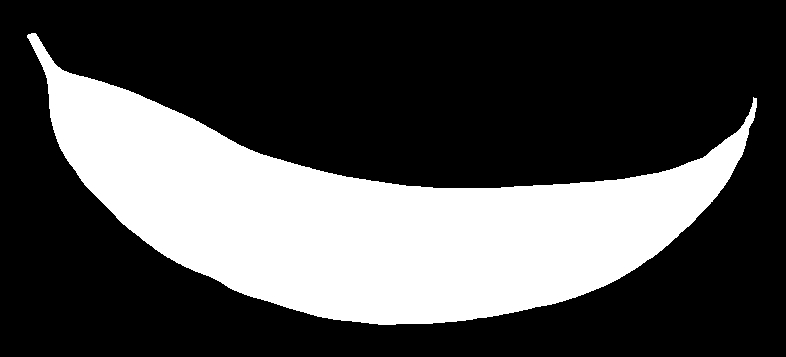
```	    
	    

```{r kgs, fig.cap="Steps followed by a Leaf image in Kaggle image dataset which is bent", fig.pos='h!', fig.height = 5, fig.width = 8, out.width="70%",out.height="30%", fig.align="center"}
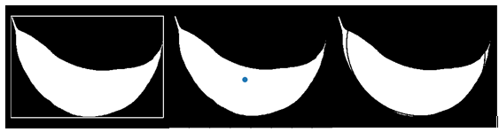
```


```{r kgce, fig.cap="Center of leaf image in Kaggle image dataset", fig.pos='h!', fig.height = 5, fig.width = 8, out.width="70%",out.height="30%", fig.align="center"}
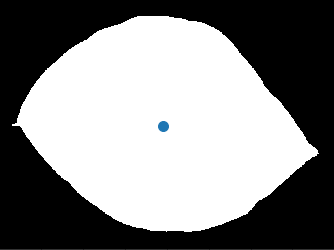
```

|       All the leaves are horizontal or vertical in the images. Therefore by drawing the bounding rectangle around the contour (see figure \ref{fig:kgbd}), calculate the shape features like psychological length and width easily. 


```{r kgbd, fig.cap="Bounded rectangle leaf image in Kaggle image dataset", fig.pos='h!', fig.height = 5, fig.width = 8, out.width="70%",out.height="30%", fig.align="center"}
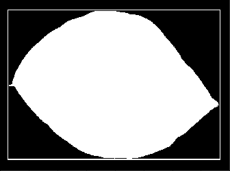
```	    

|       Texture and colour features are not calculated since the leaf images are binary images. Shape and scagnostic features are defined because the contour is determined. 


```{r kge, fig.cap="Ellipse of leaf image in Kaggle image dataset", fig.pos='h!', fig.height = 5, fig.width = 8, out.width="70%",out.height="30%", fig.align="center"}
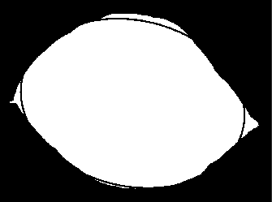
```

**Example 2: Color leaf image datasets**

|       There are three color image leaf datasets (Flavia, Actual, Swedish) are used. After passing through the required image processing steps, binary image is extracted which has a white foreground and black background.


```{r fl5, fig.cap="Image processing steps of Flavia dataset", fig.pos='h!', fig.height = 5, fig.width = 8, out.width="70%",out.height="30%", fig.align="center"}
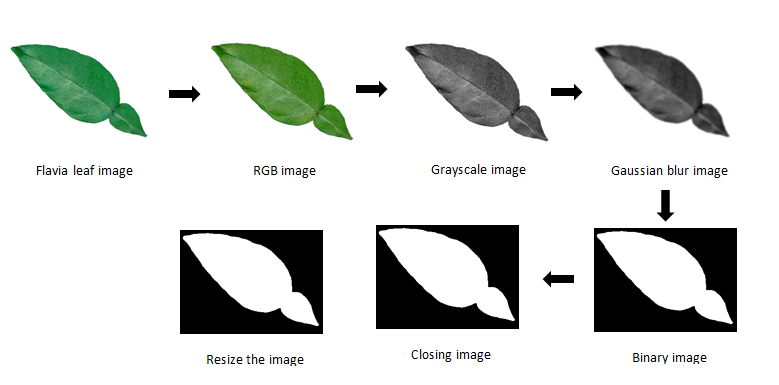
```	    
	    

|       The leaf images are taken as the closest ones. Therefore to find the best contour among several contours, can use the contour which contains the center of leaf image. Identify the best contour is really important when extracting shape features.


```{r fl1, fig.cap="Contour of leaf image in Flavia dataset", fig.pos='h!', fig.height = 5, fig.width = 8, out.width="70%",out.height="30%", fig.align="center"}
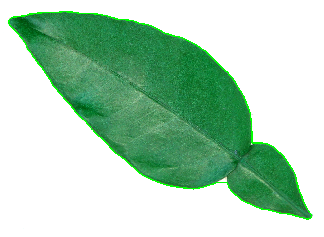
```


```{r fl2, fig.cap="Center of leaf image in Flavia dataset", fig.pos='h!', fig.height = 5, fig.width = 8, out.width="70%",out.height="30%", fig.align="center"}
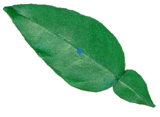
```

	    
```{r fl3, fig.cap="Ellipse of leaf image in Flavia dataset", fig.pos='h!', fig.height = 5, fig.width = 8, out.width="70%",out.height="30%", fig.align="center"}
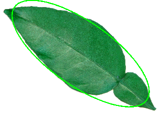
```


```{r fl4, fig.cap="Bounded rectangle leaf image in Flavia dataset", fig.pos='h!', fig.height = 5, fig.width = 8, out.width="70%",out.height="30%", fig.align="center"}
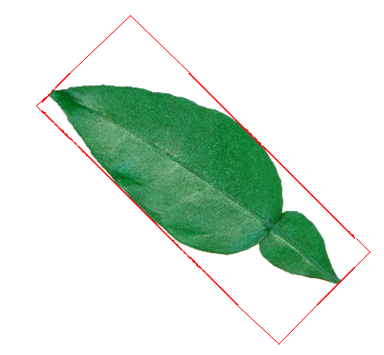
```

